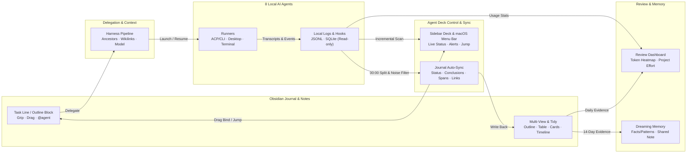

# Agent Deck

> Delegate AI work from your journal. Review daily token usage and project activity in a dashboard.

[中文](README.md) ｜ **English** ｜ [GitHub Releases](https://github.com/MatsuriMW/obsidian-agent-deck/releases) ｜ [Changelog](CHANGELOG.md)

This project is still early and evolving quickly. Some parts of the experience may be rough, and occasional updates may introduce breaking changes. Check the [Roadmap](https://matsuri.site/portfolio/journal-workflow/#whistlist) to submit suggestions and vote on upcoming features, or open a [GitHub Issue](https://github.com/MatsuriMW/obsidian-agent-deck/issues) / email [klauschen2799@gmail.com](mailto:klauschen2799@gmail.com) to report bugs.

<p align="center">
  <a href="https://github.com/MatsuriMW/obsidian-agent-deck/releases/download/1.2.1/agent-deck-demo-4k60.mp4"></a>
</p>

<p align="center">25-second demo (Chinese captions) · click for the <a href="https://github.com/MatsuriMW/obsidian-agent-deck/releases/download/1.2.1/agent-deck-demo-4k60.mp4">4K60 version with sound</a></p>

Agent Deck brings AI agent sessions scattered across separate local clients onto one deck inside Obsidian: see at a glance which agent is running, which one is waiting for you, and how far each has progressed. Delegate work directly from any task line in your notes, and let progress, active time, and answers flow back into the same journal.

---

## Core Architecture & Information Flow


```mermaid
flowchart LR
  subgraph NOTE["Obsidian Journal & Notes"]
    direction TB
    Task["Task Line / Outline Block\nGrip · Drag · @agent"]
    Views["Multi-View & Tidy\nOutline · Table · Cards · Timeline"]
  end
  subgraph HARNESS["Delegation & Context"]
    Ctx["Harness Pipeline\nAncestors · Wikilinks · Model"]
  end
  subgraph AGENTS["8 Local AI Agents"]
    direction TB
    Run["Runners\nACP/CLI · Desktop · Terminal"]
    Logs["Local Logs & Hooks\nJSONL · SQLite (Read-only)"]
  end
  subgraph DECK["Agent Deck Control & Sync"]
    direction TB
    Panel["Sidebar Deck & macOS Menu Bar\nLive Status · Alerts · Jump"]
    Sync["Journal Auto-Sync\nStatus · Conclusions · Spans · Links"]
  end
  subgraph INSIGHT["Review & Memory"]
    direction TB
    Dash["Review Dashboard\nToken Heatmap · Project Effort"]
    Dream["Dreaming Memory\nFacts/Patterns · Shared Note"]
  end
  Task -->|"Delegate"| Ctx
  Ctx -->|"Launch / Resume"| Run
  Run -->|"Transcripts & Events"| Logs
  Logs -->|"Incremental Scan"| Panel
  Panel <-->|"Drag Bind / Jump"| Task
  Logs -->|"00:00 Split & Noise Filter"| Sync
  Sync -->|"Write Back"| Views
  Logs -->|"Usage Stats"| Dash
  Views -->|"Daily Evidence"| Dash
  Views -->|"14-Day Evidence"| Dream
```

---

## Core Features

### 1. Unified Multi-Agent Session Panel
- **Tracks 7 local agents**: **Claude Code, Codex, WorkBuddy, DeepSeek Harness, Antigravity, OpenCode, and Qoder**.
- **Live status & quick jump**: Distinguishes running, waiting for reply, needs approval, hit limit, paused, errored, and finished sessions; click a session card to switch back to its client or terminal tab (see per-agent boundaries below).
- **Primary agents & global search**: Pin up to 2 primary agents for full history and cross-day catch-up (other enabled agents read sessions active today); search across all scanned local sessions by title, project, model, or content, and view a 14-day activity trend.

### 2. Task-Line Delegation & Drag-and-Drop Binding
- **Three ways to delegate**:
  - Click the paper-plane grip at the end of a task line (or double-click / `⌘`-click to pick the agent);
  - Drag a list item from your note onto an agent card in the sidebar;
  - Type `@` in a task line to pick an agent, then `/` for model and reasoning effort (e.g. `@codex/gpt-6.1-sol/high`).
- **Pre-send preview & full context**: Preview the block and choose a work destination before sending; delegating a sub-item automatically carries its ancestor chain (excluding unrelated sibling branches) and its child subtree, and you can edit an AI reply block to delegate again from it.
- **Drag to bind**: Drop a session card onto an existing list item to bind it, or onto an empty line to create a new bound task. Regular bound sessions show a status pill. Background tasks show one progress row below the parent task with cancel/retry actions; it disappears when the answer is ready.

### 3. Human–AI Journal, Organization & Archiving
- **Auto-journaling & write-back**: Periodically matches or creates daily-note task lines for today's sessions and syncs status, `⏱` active spans, per-turn records (brief / standard / detailed), and nested child session / side-chat / subagent blocks. Background answers of up to 500 characters are written inline in full; longer answers return a link to a Markdown file under `Agent Deck/Answers/` containing the full question and answer with internal tracking metadata removed. No extra summary model is called. Regular session conclusions default to 350 characters, with long addresses shortened to clickable labels.
- **Title protection & record folding**: Preserves manually edited AI task titles verbatim; shows only the latest AI conclusion by default while keeping history expandable; supports manual status locking; keeps internal tracking IDs hidden and removes them automatically on completion or archival.
- **Four persistent record views**: Switch any top-level AI record block in place between **Outline / Table / Cards / Timeline** (persisted per block without rewriting underlying Markdown):

<p align="center">
  
</p>
<p align="center">
  
</p>

- **One-click tidy & archive**: **Tidy log** reorganizes the current daily note by template (in progress, to do, completed, framed by dividers). Only complete bounded sections are organized; outside notes stay unchanged. Notes without a complete frame receive empty sections; **Archive finished logs to…** moves completed AI blocks out of the journal into a target note grouped by date.
- **Nautilus Spiral compatibility**: Works alongside [Nautilus Spiral](https://github.com/MatsuriMW/nautilus-spiral) by letting Agent Deck handle AI note writes while Nautilus keeps scheduling and tracking displays (Agent Deck restores token display whenever Nautilus does not show tokens for the same session).

### 4. Review Dashboard (Experimental, On by Default)
- Displays a GitHub-style **daily token heatmap** and **24-hour rhythm & concurrency** chart (input, output, and cache reads; does not represent monetary cost, with no estimates when missing) with 7/30/90-day, 1-year, and custom date filters.
- Summarizes **By Agent** (with official Agent icons) and **By Model** (tokens, per-turn average, cache hit ratio) for linked filtering, and aggregates **Project activity** (sortable by tokens, active time, sessions, or name in ascending/descending order) from note links, titles, folders, keywords, and aliases; supports manual project overrides, per-day drill-down, and jumping back to the source journal block or session.
- Uses only locally tracked history; makes no extra model calls and never modifies your journal.

<p align="center">
  
</p>

### 5. macOS Menu Bar Helper, Dreaming & Bilingual UI
- **Solid macOS menu bar panel**: An always-accessible icon (or customizable global shortcut **`⌃⌥⌘D`**) for checking today's metrics and active/waiting sessions from any app and jumping straight to them.
- **Dreaming long-term memory (optional, off by default)**: Distills long-term memories from the past 14 days of journals and delegated notes into editable Markdown with optional export/sync.
- **Automatic UI language**: Follows Obsidian's language setting (Chinese or English) without changing note contents or CLI prompts.

---

## Supported Agents at a Glance

| Agent | Session Tracking | Background Delegation | Desktop Handoff | Terminal Interactive | Direct Session Jump |
|---|---|---|---|---|---|
| **Claude Code** | Yes | Yes (`claude`) | Yes (auto-opens after turn 1) | Yes | Yes (desktop / terminal tab) |
| **Codex** | Yes | Yes | Yes (via App Server after turn 1) | Yes | Yes (desktop / terminal tab) |
| **DeepSeek Harness** | Yes | Yes (`dsh acp`) | Opens app only | — | Focuses app & copies session ID |
| **Antigravity** | Yes | Yes (`agy acp`) | No | — | Focuses app & copies session ID |
| **OpenCode** | Yes | Yes (`opencode-cli acp`) | Opens app only (shared DB) | Yes | Manual selection in app |
| **Qoder** | Yes | Yes (`qodercli`) | Clipboard handoff to desktop | Yes | CLI resumes in terminal; desktop DB is separate |
| **WorkBuddy** | Yes | No | Clipboard handoff to desktop | Yes (`codebuddy`) | Native WorkBuddy sessions only |

---

## Installation & Requirements

### 1. Installing the Plugin
Agent Deck is not in the Obsidian community plugin directory yet. Install manually (current version **1.9.8**, requires Obsidian **1.4.0+** desktop):

1. Download `main.js`, `manifest.json`, and `styles.css` from [GitHub Releases](https://github.com/MatsuriMW/obsidian-agent-deck/releases).
2. Place all 3 files in `<your-vault>/.obsidian/plugins/agent-deck/`.
3. Enable **Agent Deck** in **Settings → Community plugins**.

<details>
<summary>Building from source (developers only)</summary>

Requires Node.js and npm:

```bash
git clone https://github.com/MatsuriMW/obsidian-agent-deck.git
cd obsidian-agent-deck
npm install
npm run build
```

Copy the generated `main.js`, `manifest.json`, and `styles.css` into `<your-vault>/.obsidian/plugins/agent-deck/` (or run `npm run install:plugin -- <vault-path>`).

</details>

### 2. Runtime Dependencies (Prepare Only What You Use)

- **Tracking, binding & Review Dashboard only**: **No extra dependencies required.** The plugin reads local client logs directly and makes no network requests.
- **Delegation, auto-journaling, AI summaries/polishing & Dreaming**: Require the corresponding local agent CLI or desktop app to be installed and authenticated:

| Feature / Agent | Required on Your Machine |
|---|---|
| **Claude Code** | Installed and authenticated `claude` CLI (plus Claude desktop app for desktop continuation) |
| **Codex** | Installed and authenticated `codex` CLI and Codex desktop app (bundled CLI is supported) |
| **DeepSeek Harness** | ACP-capable `dsh` installation with valid model/provider credentials |
| **Antigravity** | Standalone **Antigravity CLI (`agy`)** with CLI login (installing the IDE alone is not enough) |
| **OpenCode** | OpenCode desktop app (bundles `opencode-cli`) or standalone `opencode` CLI with configured provider |
| **Qoder** | `qodercli` installed and logged in for background/terminal delegation; Qoder desktop app for desktop handoff |
| **WorkBuddy** | Chinese-edition WorkBuddy desktop app (`codebuddy` CLI separately if using terminal mode) |
| **Auto-journaling / AI summaries / Dreaming** | At least one authenticated `claude` or `codex` CLI with available quota (configured under Records settings) |
| **macOS menu bar helper** | `swiftc` from Xcode Command Line Tools (`xcode-select --install`); can be disabled in settings if unused |

> **Notes**:
> - When Obsidian launches from the macOS GUI, its `PATH` may differ from your terminal. If a binary isn't found, set its full absolute path in plugin settings.
> - The **Check** button in settings only verifies executable paths and versions—it does **not** prove login status or model quota. Verify authentication in your terminal before delegating.

---

## Current Limitations & Unsupported Features

1. **Platform Support**
   - **Desktop only**: Obsidian mobile is not supported.
   - **Windows unverified**: Developed and tested on macOS; 1.9.8 has not been verified on Windows yet. The menu bar helper is macOS-only, and terminal tab switching / several binary discovery paths currently rely on macOS tooling.
2. **No Generic Remote API Delegation**
   - Automatic delegation launches local CLI or desktop processes. There is no generic remote API/SDK backend, and the plugin does not install CLIs or sign users in automatically.
3. **No In-Plugin Follow-Up Chat**
   - The transcript modal inside Obsidian is read-only (for inspecting, stopping the current turn, and archiving conversations); follow-up turns must be continued in each agent's own desktop app or terminal.
4. **Per-Agent Boundaries**
   - **WorkBuddy**: Only the **Chinese edition** is supported; international **WorkBuddy AI** is not supported. Managed background execution is unavailable, and independent `codebuddy` CLI sessions cannot be imported into the WorkBuddy desktop app.
   - **Qoder**: `qodercli` sessions and the Qoder desktop database are separate—background tasks resume in terminal (`qodercli -r <id>`), and desktop mode uses clipboard handoff. Token counts are not estimated when omitted by the desktop format.
   - **Antigravity**: CLI sessions and original IDE sessions do not mix, archive detection is not guaranteed, and exported transcripts exclude tool outputs, internal reasoning, and attachments.
   - **DeepSeek Harness**: The desktop client is still evolving rapidly with limited stability, and deep links do not jump directly to a specific session.
   - **OpenCode**: CLI and desktop share local storage, but launching the desktop app still requires selecting the session manually.
5. **Terminal Delegation Verification**
   - Interactive terminal delegation is currently verified end-to-end only on **Tern** and **Herdr**. **Terminal.app, iTerm2, and Warp** are untested (Warp lacks a scripting interface and can only be brought forward).
6. **Planned / Not Yet Implemented**
   - **Multi-view AI record rendering in Reading view and Kanban view**, **modern Cursor desktop tracking**, **Grok Bot (Sand) tracking & per-bot filtering**, **Pi support**, **choosing model / effort / recording granularity directly inside the delegation sheet**, **per-block granularity overrides on existing AI blocks**, **automatic send for WorkBuddy**, and **LLM Wiki auto-ingestion** are planned on the roadmap and not available in this release.

---

## Privacy & License

- **Local-first**: Session parsing, panel analytics, the Review Dashboard, and the macOS menu bar helper only read local files and send zero telemetry. Task text or journal excerpts are sent to your locally configured CLI model provider only when you run delegation, AI organization/summarization, or Dreaming.
- **License**: [Apache 2.0](LICENSE) (see also [NOTICE](NOTICE)).
- **More docs**: Full version history in [CHANGELOG.md](CHANGELOG.md); developer specs, architecture, and roadmap notes in [docs/](docs/).
- **Feedback & Roadmap**: Open a [GitHub Issue](https://github.com/MatsuriMW/obsidian-agent-deck/issues) to report bugs or visit the [Roadmap](https://matsuri.site/portfolio/journal-workflow/#whistlist) to submit and vote on feature ideas.
- **Updates**: Follow [@Matsurimywaifu](https://x.com/Matsurimywaifu) on X/Twitter.
