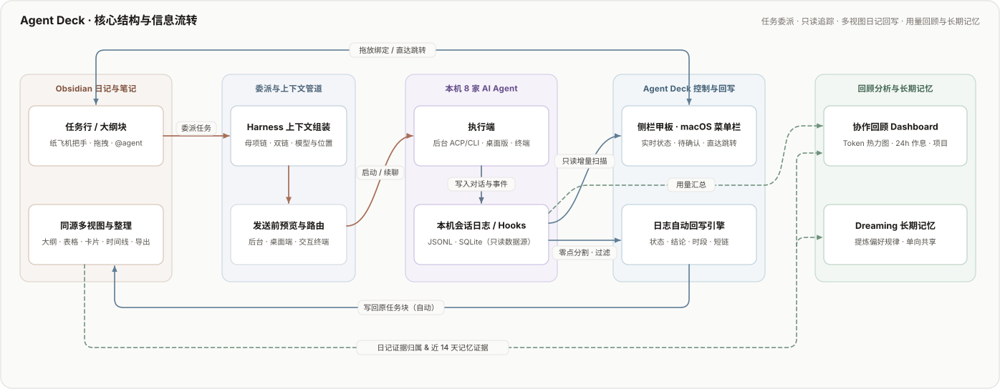
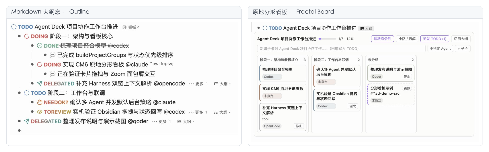
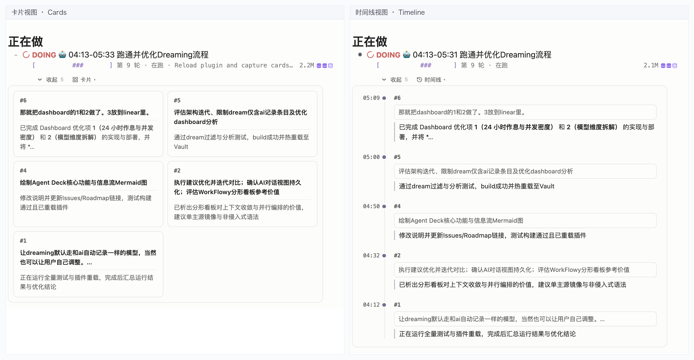

# Agent Deck（智能体甲板）

> 从日记委派 AI 任务，用 Dashboard 回顾每天的 token 用量和项目投入。

**中文** ｜ [English](README.en.md) ｜ [GitHub Releases](https://github.com/MatsuriMW/obsidian-agent-deck/releases) ｜ [更新日志](CHANGELOG.md)

项目目前处于早期高速迭代阶段，体验可能偶有打磨不足或破坏式更新。欢迎在 [Roadmap](https://matsuri.site/portfolio/journal-workflow/#whistlist) 查看后续规划、添加建议并投票，或通过 [GitHub Issues](https://github.com/MatsuriMW/obsidian-agent-deck/issues) 与邮件 [klauschen2799@gmail.com](mailto:klauschen2799@gmail.com) 反馈问题。

<p align="center">
  <a href="https://github.com/MatsuriMW/obsidian-agent-deck/releases/download/1.2.1/agent-deck-demo-4k60.mp4"></a>
</p>

<p align="center">25 秒演示 · 点图看 <a href="https://github.com/MatsuriMW/obsidian-agent-deck/releases/download/1.2.1/agent-deck-demo-4k60.mp4">4K60 有声版</a> ｜ 国内可看：<a href="https://matsuri.site/demo/agent-deck/">matsuri.site/demo/agent-deck</a></p>

Agent Deck 把本机分散在各客户端中的 AI Agent 会话集中到 Obsidian 的同一张甲板上：哪个 Agent 在运行、哪个在等待确认、推进到哪一步，一目了然；需要派发任务时，直接从日记或笔记里的任务行委派出去，进度、用时和结论再自动写回这一行。

---

## 核心结构与信息流转

<p align="center">
  
</p>

---

## 核心功能

### 1. 多 Agent 会话追踪面板
- **统一收拢 9 类本地 Agent**：支持 **Claude Code、Codex、WorkBuddy、DeepSeek Harness、Antigravity、OpenCode、Qoder**，以及 **Cursor**（3.30.14+ Hooks，仅追踪）与 **Grok Bot**（Sand 桌面端，按 Bot 多选，仅追踪）。
- **按项目聚合的并发进程管理**：侧栏「现在」默认按工作区项目收拢多 Agent 活跃会话与异常状态（`在跑 / 等你 / 异常`），支持一键打开项目目录、进入项目工作台或批量停止本项目活跃任务，也可切回扁平「列表」；「最近的会话」支持按 `7 天 / 30 天 / 120 天` 切换，并在「按 Agent」与「按项目」叠放分组间切换。
- **实时状态与跳转**：区分运行中、等待回复、需要确认、到达限额、暂停、出错、已完成等状态；点击会话卡片可直接切回对应客户端或终端标签（支持范围见下文边界表），未生成会话号的待认领委派点击可直达原笔记行。
- **主力与全局搜索**：可设最多 2 个主力 Agent（追踪全部历史与跨天补记），其余已启用 Agent 读取当日活跃会话；支持按标题、项目、模型、正文关键字搜索全部本地扫描到的会话，并查看最近 14 天协作趋势。

### 2. 从笔记委派与双向拖拽
- **三种委派方式**：
  - 点击任务行末尾的纸飞机把手快速委派，或双击 / `⌘` 单击切换目标 Agent；
  - 直接将笔记列表项拖到侧栏 Agent 卡片上委派；
  - 在任务行内输入 `@` 选择 Agent，继续输入 `/` 选择模型和推理强度（如 `@codex/gpt-6.1-sol/high`）。
- **发送预览与双链上下文**：发送前可预览正文和子块并选择本次工作位置；从子任务委派时自动携带上层母项链（不含无关兄弟分支）、当前子树及显式 `[[双链]]` 笔记摘录，也可以在已有 AI 回复块上补充说明并再次委派。
- **拖拽绑定**：将面板中的会话卡片拖到已有任务行上完成绑定，或拖到空白行新建绑定任务；普通绑定会话在行尾显示状态 pill；后台执行在母块下方显示单条进度，保留取消与重试入口，回答结束后隐藏。

### 3. 项目协作工作台与原地分形看板
- **协作小队预设与副驾拆解**：通过侧栏工作台按钮、命令面板或任务菜单打开「项目协作工作台」，内置全栈开发、排错重构、调研与文档三套小队预设（自动避开已禁用或撞限额 Agent 并记住项目偏好）；输入目标即可用整理模型或本地规则拆解为可编辑子任务草案，写入标准 `- TODO ... @agent` Markdown（归入日记活跃区并预分配独立块号），支持人机确认后多 Agent 并发派发。
- **原地分形看板（编辑态）**：任意包含 2 个以上直接子任务（支持任务关键词、标准 `[ ]` 复选框及 `![[笔记#^blockId]]` 镜像引用）的父块行尾自动显示 `看板 N` 开关，无需离开当前笔记即可原地切换为二维看板：
  - **双分列与无限下钻（Zoom）**：支持在 **「按状态分列」**（`TODO / DOING / 待确认 / DONE`）与 **「按子组分列」**（直接子阶段为列、孙任务为卡）间切换；含子任务的卡片可通过 `↳` 角标下钻聚焦，并用顶栏面包屑回溯；
  - **看板内全流程操作**：支持进度条总览、快捷新增子卡（`+ 子卡`）、行内指派 `@agent`、跨列/跨组拖拽子树（原子改写标准 Markdown，不造私有语法）、单卡查看正文 / 停止 / 派发与一键「派发 TODO」（自动附带同看板兄弟分工上下文）；
  - **单源镜像卡**：通过 `- ![[笔记#^blockId]]` 或 `- [[笔记#^blockId]]` 引用其他笔记的任务卡，在看板内显示虚线 `镜像` 角标，改状态直接回写源笔记，且被 Dashboard 统计与 Dreaming 记忆提取自动跳过以防重复计数。

演示顺序为小队草案 → Markdown 大纲 → 子组看板；实测范围与待验收项见 [发布说明](CHANGELOG.md#演示素材与验证范围)。

<p align="center">
  
</p>
<p align="center">
  
</p>

> **首次安装 / 升级交互示例**：升级到 **1.10.0** 后首次打开 Obsidian 会自动生成并打开模拟示例笔记 `Agent Deck/功能示例-1.10.0.md`（不绑定真实会话，也不计入统计），同屏体验分形看板（含 Zoom 与同笔记镜像跳转）及 4 种 AI 记录视图；后续可通过命令面板「打开 1.10.0 新功能示例笔记」随时重开。

### 4. 人机共写日记、整理与归档
- **自动记日记与回写**：定时扫描当日会话，自动匹配或新建日记任务行，实时同步状态、`⏱` 活动时段、每轮简略/标准/详细记录以及嵌套子会话 / Side Chat / Subagent 子块；新建 AI 自动记录母块默认使用 `**标题**` 加粗突出显示并带项目 / Bot 前缀，可在「设置 → 记录 → 日记与归档 → 更多设置 → 记录规则细则」自定义加粗、前缀、起止时间段、标题长度上限与 Grok Bot 无新对话自动 `DONE` 时长；后台回答不超过 500 字时完整写入子块，超过时返回 `Agent Deck/Answers/` 中的 Markdown 文件链接（含完整问题与回答、清除内部追踪标识，不另调总结模型）。普通会话结论默认 350 字，摘要中的长网址与文件路径折叠为可点击短链。
- **标题保护与记录折叠**：保留用户手写修改过的 AI 标题不被覆盖；默认收起历史轮次仅展示最新结论；支持人工切换并锁定任务状态；内部追踪标识在编辑与阅读视图隐藏，并在完成或归档时自动清理。
- **四种持久化记录视图与按视图导出**：支持同一条 AI 自动记录在**大纲 / 表格 / 卡片 / 时间线**间就地切换并按块记住视图偏好，不改写底层 Markdown；顶层视图菜单内的「导出」子菜单可按当前视图导出展开后的 PDF 与独立 HTML，也可导出无损 Markdown（`.md`）、结构化 JSON（`.json`）、CSV（`.csv`），或一键复制 Markdown / 表格 / 纯文本 / JSON。

<p align="center">
  
</p>
<p align="center">
  
</p>

- **大纲编辑快捷键与批量任务状态**：新增 `⌥⌘↑` **跳到母块**（连按逐级向上，光标停在行尾 `^blockId` 之前）、`⌥⌘⇧↑` **跳到最上一级顶格母块**、`⌥⌘↓` **合并成组（Group rows）**，以及命令面板 / 编辑器右键菜单里的 **批量调整选中块的任务状态…**（Windows / Linux 以 `Ctrl+Alt` 替代 `⌥⌘`）：
  - **合并成组专为 AI 自动记录而设**：在日记里框选或点选任意多条 AI 自动记录（含各自子项），一次按键就在最浅缩进处上方新建空母块、把选中的记录整体降一级收进去，遵循 Obsidian 的 `useTab` / `tabSize` 设置，光标直接停在新母块上。合并后的母块行尾立刻出现「看板 N」，原地切成看板就能按状态或子组回顾这一批记录——巡检一天里散落各处的 Agent 干活记录非常好用。
  - **多选批量改状态**：拖拽框选、跨层选区与多光标（`Cmd+Click`）都支持，按所选最浅的根列表项去重，不会误改 `💬` / `🔗` 等内部记录行或子项；含关键词任务、无关键词普通列表项与 `[ ]` / `[/]` / `[x]` / `[-]` 复选框都能一次改完，整批只占一步撤销，AI 条目的人工状态锁定与「恢复自动跟随」照常生效。

- **一键整理与归档**：**整理日志**可按模板重排当天日记（正在做、还要做、已完成，各区之间与首尾有分割线），只整理完整分区内部，区外笔记保持原样；无完整分区时只建立空分区；**归档已完成的日志到…** 可将已完成的 AI 任务移出日记并按日期沉淀到指定笔记。
- **兼容螺旋日程**：可与 [螺旋日程 Nautilus Spiral](https://github.com/MatsuriMW/nautilus-spiral) 配套使用，由 Agent Deck 接管 AI 写入、螺旋保留排程与进度展示（螺旋未展示同会话 token 时由 Agent Deck 补全显示）。

### 5. 协作回顾 Dashboard（实验功能，默认开启）
- 展示 GitHub 风格的**每日 Token 热力图**与**24 小时作息与并发**时段分布（含输入、输出与缓存读取，不代表费用；无数据时不估算），支持按最近 7/30/90 天、一年或自定义日期范围筛选。
- 统计 **Agent 分布**与**模型分布**（Token、轮均用量、缓存命中率等）并支持联动筛选；结合日记链接、标题、目录与别名自动汇总**项目投入**（支持按 Token / 耗时 / 会话数 / 名称与升降序排序）、手动修正项目归属、按日期下钻明细并跳回来源日记块或原会话；不调用额外模型，也不改写日记。

<p align="center">
  
</p>

### 6. macOS 菜单栏助手、Dreaming 与双语界面
- **macOS 纯色菜单栏面板**：常驻菜单栏图标，点击或按全局快捷键 **`⌃⌥⌘D`**（可自定义）随时唤起，快速查看今日协作指标及运行中/待确认会话，支持直接跳转。
- **Dreaming 长期记忆（可选，默认关闭）**：基于最近 14 天日记和委派笔记提炼可编辑的长期记忆，支持导出副本或可选同步。
- **界面语言自动跟随**：跟随 Obsidian 设置自动切换中文或英文（笔记正文与发给 CLI 的提示词保持不变）。

---

## 各 Agent 支持情况一览

| Agent | 日志追踪 | 后台委派 | 桌面端交接 | 终端交互 | 直达原会话跳转 |
|---|---|---|---|---|---|
| **Claude Code** | 支持 | 支持（`claude`） | 支持（首轮后自动打开） | 支持 | 支持（桌面 / 终端标签） |
| **Codex** | 支持 | 支持 | 支持（App Server 首轮后打开） | 支持 | 支持（桌面 / 终端标签） |
| **DeepSeek Harness** | 支持 | 支持（`dsh acp`） | 仅唤起客户端 | — | 仅聚焦客户端并复制会话号 |
| **Antigravity** | 支持 | 支持（`agy acp`） | 不支持 | — | 仅聚焦客户端并复制会话号 |
| **OpenCode** | 支持 | 支持（`opencode-cli acp`） | 首轮后自动打开应用（共用本地库） | 支持 | 需在桌面端手动选会话 |
| **Qoder** | 支持 | 支持（`qodercli`） | 仅复制任务并唤起桌面端 | 支持（`qodercli`） | CLI 走终端恢复；桌面端复制会话号后手动选 |
| **WorkBuddy** | 支持 | 不支持 | 仅复制任务并唤起桌面端 | 支持（`codebuddy`） | 支持原生桌面会话直达与终端恢复 |
| **Cursor** | 支持（3.30.14+ Hooks + 日志） | 不支持 | 不支持（仅追踪） | — | 仅打开应用并复制会话号 |
| **Grok Bot** | 支持（按 Bot 多选） | 不支持 | 不支持（仅追踪） | — | 唤起 Grok Bot 桌面端 |

---

## 安装与依赖

### 1. 安装插件
可在 Obsidian 社区插件市场直接安装，或从 GitHub Releases 手动下载（当前版本 **1.10.3**，需 Obsidian **1.4.0+** 桌面端）：

1. 打开 Obsidian「设置 → 第三方插件 → 社区插件市场 → 浏览」，搜索 **Agent Deck** 并点击安装、启用。
2. 或前往 [GitHub Releases](https://github.com/MatsuriMW/obsidian-agent-deck/releases) 下载最新产物中的 `main.js`、`manifest.json`、`styles.css`，放入 `<Vault>/.obsidian/plugins/agent-deck/` 后在「设置 → 第三方插件」中启用。

<details>
<summary>从源码构建（仅开发者需要）</summary>

需要本机已安装 Node.js 与 npm：

```bash
git clone https://github.com/MatsuriMW/obsidian-agent-deck.git
cd obsidian-agent-deck
npm install
npm run build
```

构建完成后将 `main.js`、`manifest.json`、`styles.css` 放入 `<Vault>/.obsidian/plugins/agent-deck/`（或直接运行 `npm run install:plugin -- <你的Vault路径>` 跨平台复制）。

</details>

### 2. 运行依赖（按需准备，无需全装）

- **仅使用面板追踪、任务绑定与回顾 Dashboard**：**无需额外依赖**，直接读取本机已有客户端日志（Cursor 需在设置中开启 Hooks），不发起网络请求。
- **使用委派、自动记日记、AI 总结/润色与 Dreaming**：需要安装并登录你实际要用的本机 Agent CLI / 桌面端，或在整理模型处填写 OpenAI 兼容 API：

| 功能 / Agent | 需要提前准备什么 |
|---|---|
| **Claude Code** | 安装并登录 `claude` CLI（支持 `/login` 或 `~/.claude/settings.json` `env` 认证）；需桌面续聊则另装 Claude 桌面端 |
| **Codex** | 安装并登录 `codex` CLI 与 Codex 桌面端（支持复用桌面端内置 CLI） |
| **DeepSeek Harness** | 安装支持 ACP 的 `dsh`，并完成模型提供商与账号配置 |
| **Antigravity** | 安装并登录**独立 Antigravity CLI（`agy`）**（仅装 IDE 无法委派） |
| **OpenCode** | 安装 OpenCode 桌面端（内置 `opencode-cli`）或独立 `opencode` CLI 并完成配置 |
| **Qoder** | 后台与终端委派需安装并登录 `qodercli`；仅桌面复制交接需安装 Qoder 桌面端 |
| **WorkBuddy** | 安装中国版 WorkBuddy 桌面端（终端交互需另装 `codebuddy` CLI） |
| **Cursor** | 安装 Cursor 桌面端（3.30.14+），并在设置「来源与扫描 → 更多设置」中安装 Cursor Hooks（仅追踪） |
| **Grok Bot** | 安装 Grok Bot 桌面端（Sand 客户端），并在设置「记录 → 来源与扫描」的 Grok Bot 卡片内勾选要追踪的 Bot（默认全不选，仅追踪） |
| **自动记日记 / AI 总结 / Dreaming** | 任一已登录且额度可用的本地 CLI（`agy`、`claude`、`codex`、`qodercli`、`codebuddy`，含 `~/.claude/settings.json` 的 `env` 认证），或填写 **OpenAI 兼容 API**（支持 DeepSeek、OpenAI、OpenRouter、阿里云百炼 Qwen、本地 Ollama 预设或自定义地址；在「记录 → 整理模型」设置，Dreaming 默认跟随并可单独覆盖） |
| **macOS 菜单栏助手** | 需 Xcode Command Line Tools 中的 `swiftc`（未安装时可运行 `xcode-select --install`）；不用可在设置中关闭 |

> **提示**：
> - 从 macOS 图形界面启动 Obsidian 时，`PATH` 可能与终端不同；若检测不到命令，请在插件设置中填写 CLI 的完整绝对路径。
> - 委派设置页中的「检查」按钮仅验证程序路径与版本号，**不代表账号已登录或模型可用**；自动整理与 Dreaming 模型页提供「测试连接」按钮可直接验证实际返回。

---

## 当前受限与暂不支持的功能

1. **平台支持边界**
   - **仅限桌面端**：不支持 Obsidian 移动端。
   - **Windows 尚未完成实机验证**：插件在 macOS 上开发并实测，目前尚未在 Windows 上完成实机验证。macOS 菜单栏助手仅限 macOS；终端自动唤醒、标签切换与部分路径探测目前仍依赖 macOS 环境。
2. **无通用远程 API 任务委派后端**
   - 自动委派任务依赖本机 CLI 或桌面应用，暂不支持直接用远程 API Key / SDK 替代 Agent 执行任务（自动记日记、总结与 Dreaming 已支持 OpenAI 兼容 API）；插件也不会自动安装 CLI 或代为登录。
3. **不支持在插件内直接续聊**
   - Obsidian 内的对话窗口仅用于查看回复正文、停止当前轮与保存归档笔记，没有输入发送框；后续追问需回到各 Agent 的桌面客户端或终端中继续。
4. **部分客户端集成边界**
   - **Cursor**：仅支持 **3.30.14+ 桌面端** Hooks 只读追踪，不支持任务委派与终端交互；未接入 Hooks 的旧版数据库会话不纳入追踪。
   - **WorkBuddy**：仅支持**中国版** WorkBuddy；不支持国际版（WorkBuddy AI）。不支持插件管理的后台执行；独立 CodeBuddy CLI 会话无法导入 WorkBuddy 桌面端。
   - **Qoder**：`qodercli` 会话与 Qoder 桌面端数据库相互独立不互通；桌面端未输出逐轮 token 时不做估算。
   - **Antigravity**：CLI 会话与原 IDE 会话互不相通，暂不承诺自动识别归档；导出正文不包含工具执行结果、内部推理过程与附件。
   - **DeepSeek Harness**：桌面端仍在快速迭代中，稳定性有限，且暂不支持通过链接直达具体会话。
   - **OpenCode**：后台与桌面共享会话存储，但跳转打开桌面端后仍需手动选择对应会话。
   - **Grok Bot**：仅支持桌面端（Sand）持久化只读追踪与按 Bot 多选过滤；不支持任务委派与终端交互，云端沙箱无本地逐条 token/模型时显示「用量未提供」且不作估算；无归档概念，默认超过设定时长无新对话自动标为 `DONE`。
5. **终端交互委派的实测范围**
   - 在终端新开标签页自动运行交互式会话的功能，目前仅在 **Tern** 和 **Herdr** 上完成端到端实测；**系统终端（Terminal.app）、iTerm2、Warp** 尚未实测（Warp 无脚本接口，仅能前置窗口）。
6. **规划中、尚未实现的功能**
   - **阅读视图下的 AI 记录多视图与分形看板渲染**、**第二大脑显式项目上下文包（Context Pack）**、**Pi 支持**、**在委派确认弹窗内直接切换模型/强度/记录粒度**、**对已有 AI 块单独调整粒度**、**WorkBuddy 自动发送**，以及面向独立大纲 App 的 **LLM Wiki 自动摄入** 等能力仍在规划中，当前版本尚未提供。

---

## 隐私与开源协议

- **本地优先**：会话读取、面板统计、回顾 Dashboard 与 macOS 菜单栏助手均只读取本机文件，插件自身不上传任何数据。仅在用户主动触发委派、自动整理、AI 总结或 Dreaming 时，才会将对应任务文本或摘要传给本机已登录的 CLI 模型服务。
- **开源协议**：采用 [Apache 2.0](LICENSE) 协议开源（见 [NOTICE](NOTICE)）。
- **更多文档**：各版完整改动见 [CHANGELOG.md](CHANGELOG.md)；开发者架构、规范与后续方向见 [docs/](docs/)（含 [WorkFlowy 分形看板规划](docs/specs/fractal-boards-roadmap.md)）。
- **反馈与建议**：欢迎在 [GitHub Issues](https://github.com/MatsuriMW/obsidian-agent-deck/issues) 反馈问题，或前往 [Roadmap](https://matsuri.site/portfolio/journal-workflow/#whistlist) 提交想法与投票；动态更新见 Twitter [@Matsurimywaifu](https://x.com/Matsurimywaifu)。
